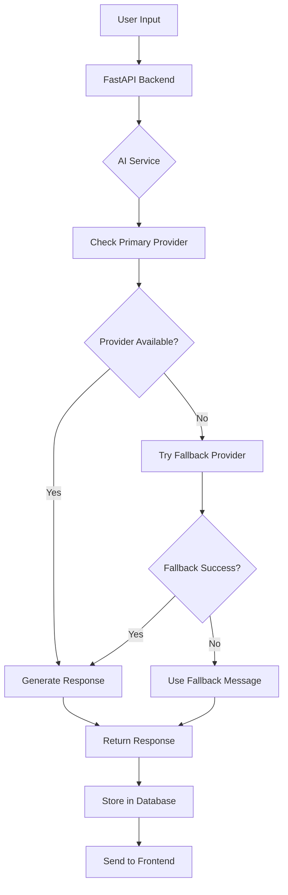

# 🤖 Chatbot với Ollama & GitHub AI

Dự án Chatbot thông minh hỗ trợ đa AI provider với khả năng fallback và tự động khôi phục.

## 📋 Tổng Quan

### 🎯 Tính Năng Chính
- **Đa AI Provider**: Hỗ trợ Ollama (local) và GitHub AI (cloud)
- **Auto Fallback**: Tự động chuyển đổi khi một provider gặp sự cố
- **Resilient Architecture**: Service vẫn hoạt động khi AI offline
- **Voice Support**: Nhận diện giọng nói và text-to-speech
- **Docker Ready**: Triển khai dễ dàng với Docker Compose
- **Production Ready**: Monitoring, health checks, logging

### 🏗️ Kiến Trúc Hệ Thống

```
┌─────────────────┐    ┌─────────────────┐    ┌─────────────────┐
│   Frontend      │    │    Backend      │    │   AI Providers  │
│   (React)       │◄──►│   (FastAPI)     │◄──►│                 │
│                 │    │                 │    │  • Ollama       │
│  • Chat UI      │    │  • API Routes   │    │  • GitHub AI    │
│  • Voice UI     │    │  • AI Service   │    │  • Fallback     │
│  • History      │    │  • Database     │    │                 │
└─────────────────┘    └─────────────────┘    └─────────────────┘
```

### 🔄 Luồng Xử Lý



## 🚀 Cài Đặt Nhanh

### Bước 1: Clone Repository
```bash
git clone <your-repo-url>
cd chatbot-project
```

### Bước 2: Cấu Hình
```bash
# Copy templates
cp .env.example .env
cp backend/config.json.example backend/config.json

# Chỉnh sửa cấu hình
nano backend/config.json
```

### Bước 3: Khởi Động Development
```bash
# Development mode
docker-compose up --build

# Hoặc production mode
docker-compose -f docker-compose.prod.yml up -d
```

### Bước 4: Kiểm Tra
- Frontend: http://localhost:3000
- Backend API: http://localhost:8000
- Ollama API: http://localhost:11434
- Health Check: http://localhost:8000/health

## ⚙️ Cấu Hình Chi Tiết

### 🔧 Backend Configuration (config.json)

```json
{
  "DB_PATH": "/app/data/chatbot.db",
  
  "OLLAMA_BASE_URL": "http://localhost:11434",
  "OLLAMA_MODEL": "gemma2:9b",
  "OLLAMA_MAX_TOKENS": 2000,
  
  "API_KEY": "your_github_token_here",
  "BASE_URL": "https://models.github.ai/inference",
  "MODEL": "openai/gpt-4o-mini",
  
  "PREFERRED_AI_PROVIDER": "ollama",
  "AUTO_FALLBACK": true,
  
  "TEMPERATURE": 0.7,
  "MAX_TOKENS": 1000,
  "REQUEST_TIMEOUT": 60,
  
  "SYSTEM_PROMPT": "Bạn là trợ lý ảo Bixby...",
  "FALLBACK_MESSAGE": "Em là Bixby! Em đã nhận được tin nhắn...",
  "ERROR_MESSAGE": "Em là Bixby! Xin lỗi, em gặp chút vấn đề..."
}
```

### 🐳 Docker Configuration

#### Development
```bash
# Khởi động với auto-reload
docker-compose up --build

# Xem logs
docker-compose logs -f backend

# Restart service
docker-compose restart backend
```

#### Production
```bash
# Deploy production
docker-compose -f docker-compose.prod.yml up -d

# Scale services
docker-compose -f docker-compose.prod.yml up -d --scale backend=2

# Update without downtime
docker-compose -f docker-compose.prod.yml up -d --no-deps backend
```

### 🤖 AI Provider Configuration

#### Ollama Setup
```bash
# Manual Ollama install (nếu không dùng Docker)
curl -fsSL https://ollama.ai/install.sh | sh

# Khởi động Ollama
ollama serve

# Download models
ollama pull gemma2:9b
ollama pull llama3.1:8b
ollama pull qwen2.5:7b

# List models
ollama list
```

#### GitHub AI Setup
1. Tạo GitHub Personal Access Token
2. Cấu hình trong `config.json`:
   - `API_KEY`: Token của bạn
   - `BASE_URL`: https://models.github.ai/inference
   - `MODEL`: openai/gpt-4o-mini (hoặc model khác)

## 📁 Cấu Trúc Thư Mục

```
chatbot-project/
├── backend/                 # FastAPI Backend
│   ├── main.py             # Entry point
│   ├── config/             # Configuration
│   │   ├── settings.py     # Settings loader
│   │   └── database.py     # Database config
│   ├── services/           # Business logic
│   │   ├── ai_service.py   # AI service cơ bản
│   │   ├── enhanced_ai_service.py  # AI service nâng cao
│   │   ├── voice_service.py # Voice processing
│   │   └── chat_service.py # Chat management
│   ├── models/             # Database models
│   ├── routes/             # API routes
│   ├── scripts/            # Utility scripts
│   │   ├── startup_with_ollama.sh  # Startup script
│   │   ├── ollama_manager.py       # Ollama manager
│   │   └── init_db.py             # Database init
│   ├── data/               # Database files (git ignored)
│   ├── logs/               # Log files (git ignored)
│   ├── Dockerfile          # Docker image
│   ├── requirements.txt    # Python dependencies
│   ├── config.json.example # Config template
│   └── config.json         # Real config (git ignored)
│
├── frontend/               # React Frontend
│   ├── src/
│   │   ├── components/     # React components
│   │   ├── services/       # API services
│   │   └── utils/          # Utilities
│   ├── public/
│   ├── Dockerfile
│   ├── .env.example
│   └── .env                # Real env (git ignored)
│
├── nginx/                  # Reverse proxy
│   ├── nginx.conf
│   └── ssl/               # SSL certificates
│
├── scripts/               # Project scripts
│   ├── security_check.sh  # Security audit
│   ├── backup.sh          # Database backup
│   └── deploy.sh          # Deployment
│
├── docs/                  # Documentation
├── docker-compose.yml     # Development
├── docker-compose.prod.yml # Production
├── .env.example           # Environment template
├── .env                   # Real environment (git ignored)
├── .gitignore
└── README.md
```

## 🔧 Troubleshooting

### ❌ Ollama Không Khởi Động
```bash
# Kiểm tra Ollama service
docker-compose exec backend curl -f http://localhost:11434/api/tags

# Xem logs
docker-compose logs backend | grep ollama

# Restart Ollama service
docker-compose exec backend pkill ollama
docker-compose exec backend /app/startup.sh
```

### ❌ Model Không Download
```bash
# Download manual
docker-compose exec backend ollama pull gemma2:9b

# Kiểm tra disk space
docker-compose exec backend df -h

# Kiểm tra network
docker-compose exec backend ping -c 3 registry.ollama.ai
```

### ❌ AI Service Offline
```bash
# Health check
curl http://localhost:8000/health

# Check provider status
curl http://localhost:8000/ai/status

# Restart AI service
docker-compose restart backend
```

### ❌ Database Lỗi
```bash
# Backup database
docker-compose exec backend cp /app/data/chatbot.db /app/data/chatbot.db.backup

# Reset database
docker-compose exec backend python /app/scripts/init_db.py

# Check database
docker-compose exec backend sqlite3 /app/data/chatbot.db ".tables"
```

## 🚀 Production Deployment

### 1. Chuẩn Bị Server
```bash
# Update system
sudo apt update && sudo apt upgrade -y

# Install Docker
curl -fsSL https://get.docker.com -o get-docker.sh
sudo sh get-docker.sh

# Install Docker Compose
sudo apt install docker-compose -y

# Create project directory
sudo mkdir -p /opt/chatbot
sudo chown $USER:$USER /opt/chatbot
```

### 2. Deploy Application
```bash
# Clone project
cd /opt/chatbot
git clone <your-repo> .

# Setup configuration
cp .env.example .env
cp backend/config.json.example backend/config.json

# Edit configurations
nano .env
nano backend/config.json

# Create required directories
mkdir -p data logs ollama_models

# Start services
docker-compose -f docker-compose.prod.yml up -d

# Check status
docker-compose ps
```

### 3. SSL & Domain Setup
```bash
# Install Certbot
sudo apt install certbot -y

# Generate SSL certificate
sudo certbot certonly --standalone -d your-domain.com

# Copy certificates to nginx
sudo cp /etc/letsencrypt/live/your-domain.com/* ./nginx/ssl/

# Update nginx config
# Edit nginx/nginx.conf với domain của bạn

# Restart nginx
docker-compose restart nginx
```

### 4. Monitoring Setup
```bash
# Install monitoring tools
docker-compose exec backend pip install prometheus-client

# Setup log rotation
sudo logrotate -f /etc/logrotate.conf

# Setup backup cron
crontab -e
# Add: 0 2 * * * /opt/chatbot/scripts/backup.sh
```

## 📊 Monitoring & Maintenance

### Health Checks
```bash
# Service health
curl http://localhost:8000/health

# AI provider status
curl http://localhost:8000/ai/status

# Database status
curl http://localhost:8000/db/health

# System resources
docker stats
```

### Log Management
```bash
# View logs
docker-compose logs -f backend
docker-compose logs -f frontend

# Log rotation
docker-compose exec backend logrotate /etc/logrotate.conf

# Clear old logs
find ./logs -name "*.log" -mtime +7 -delete
```

### Performance Tuning
```bash
# Optimize Docker images
docker system prune -a

# Monitor memory usage
docker exec backend free -h

# Check disk usage
docker exec backend df -h

# Optimize database
docker exec backend sqlite3 /app/data/chatbot.db "VACUUM;"
```

## 🔒 Security Guidelines

### 🚨 Quan Trọng - KHÔNG BAO GIỜ COMMIT:
- API keys, tokens, passwords
- Database files (*.db, *.sqlite)
- Log files (*.log)
- Model files lớn (*.bin, *.model)
- Các file .env thực tế

### ✅ Best Practices:
- Sử dụng .env.example templates
- Giữ .env files trong .gitignore
- Regular security audits
- Update dependencies thường xuyên
- Monitor logs for suspicious activity

## 📞 Support & Troubleshooting

### Common Issues:
1. **Ollama không khởi động**: Kiểm tra RAM, disk space
2. **Model không download**: Kiểm tra network, proxy settings
3. **AI responses chậm**: Tối ưu model size, hardware
4. **Database lỗi**: Backup và migrate
5. **Docker build fail**: Clear cache, check dependencies

### Debugging Steps:
```bash
# 1. Check overall status
docker-compose ps

# 2. View detailed logs
docker-compose logs backend | tail -100

# 3. Test components individually
curl http://localhost:8000/health
curl http://localhost:11434/api/tags

# 4. Enter container for debugging
docker-compose exec backend bash

# 5. Check resource usage
docker stats --no-stream
```

### Getting Help:
- Check logs đầu tiên: `docker-compose logs backend`
- Verify configuration: `backend/config.json`
- Test network connectivity: `curl` commands
- Resource monitoring: `docker stats`

---

## 🎉 Chúc Mừng!

Bây giờ bạn đã có một Chatbot hoàn chỉnh với:
- ✅ Auto Ollama setup
- ✅ Fallback mechanism
- ✅ Production-ready deployment
- ✅ Monitoring & health checks
- ✅ Voice support
- ✅ Database persistence

**Next Steps:**
1. Customize system prompts
2. Add more AI models
3. Implement user authentication
4. Add analytics dashboard
5. Setup CI/CD pipeline

Happy Chatting! 🤖✨